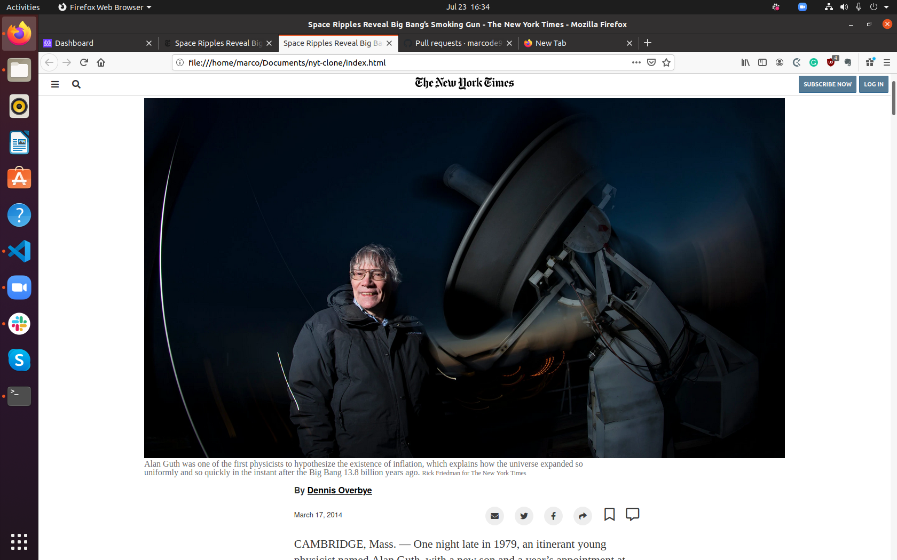

# lintersconfiguration


# POSITIONING AND FLOATING ELEMENTS

> This project was developed as a learning project part of the Microverse curriculum.



An HTML and CSS mockup of the new york times page. We used Float, Grid and Flexbox properties to achieve the same layout and proportions of the original page

## Live demo

🔗 [New york times page](https://rawcdn.githack.com/marcode95/nyt-clone/16af6b1e94b5dd3f19860a25bdb811782c24cce3/index.html)

## Built With

- HTML5,
- CSS3,
- Google Fonts,
- Font awesome


## Getting Started

To get a local copy up and running follow these simple example steps.

### Prerequisites

Webbrowser and access to internet

### Install

1) [Download](Clone the repository to your machine)

```sh
$ git clone https://github.com/marcode95/nyt-clone/tree/feature 
```

2) Navigate to the project folder and execute the "index.html" file.

### Usage

Just navigate through the page.

## Authors

👤 **Marco Erhardt**

- Github: [@marcode95](https://github.com/marcode95)


👤 **Nkiruka Awotoruvie**

- Github: [@enkog](https://github.com/enkog)
- Twitter: [@enkodes](https://twitter.com/enkodes)


## 🤝 Contributing

Contributions, issues and feature requests are welcome!

Feel free to check the [issues page](issues/).

## Show your support

Give a ⭐️ if you like this project!

## Acknowledgments

- Microverse for showing the way for this project to happen

## 📝 License

This project is [MIT](lic.url) licensed.
